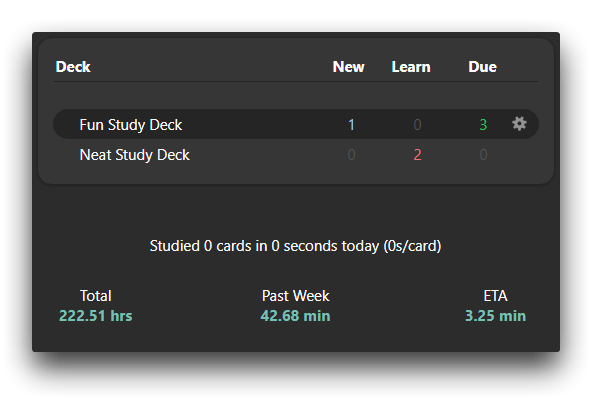
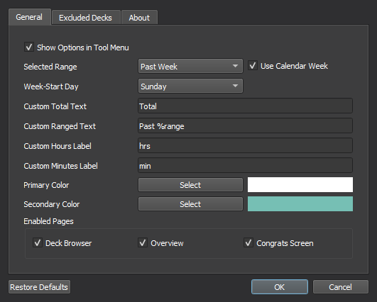
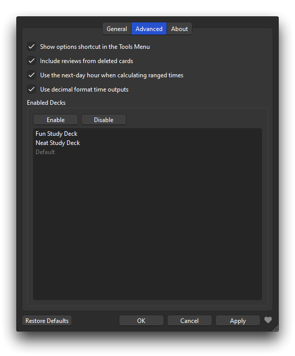
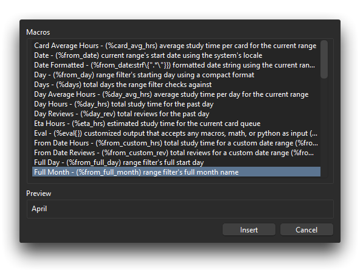

# 
Study Time Stats 

Add some customizable study time and review count statistics to Anki's main window!
  

## Installation

Install from [Anki-Web](https://ankiweb.net/shared/info/1247171202)  
Or through Anki via: Tools -> Add-ons -> Get Add-ons...
> 1247171202

## Options

### General

Customize the style, column count, range, text, code, and output for all rendered statistics!

### Advanced

Exclude decks, change time formats, and other miscellaneous options!

## Macros

Custom text macros can be used for all stat outputs!

These can be accessed via the "Add Text Macro" button (or the little "+" to the right of the text inputs).

#### Bugs/Issues:

Please post any issues/feedback you might have over the project's
on [GitHub](https://github.com/iamjustkoi/StudyTimeStats/issues).
  

Wish you the best! -koi

MIT License ©2022-2023 JustKoi (iamjustkoi)
