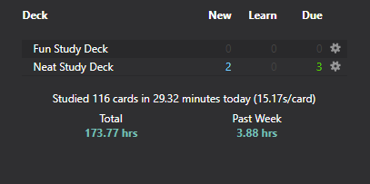
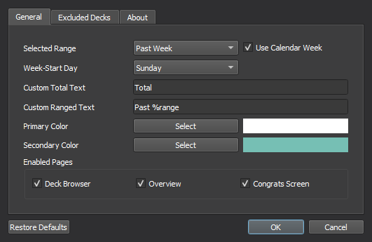
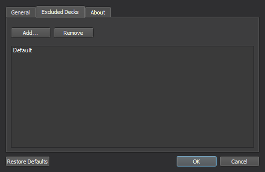

# Study Time Stats
Adds some total and ranged study time statistics to Anki's main window.  

## Installation  
Install from [Anki-Web]()  
Or from Anki (Tools -> Add-ons -> Get Add-ons..)
> 1247171202

## Options Menu  
### General
These can be used to change the look/wording of the text and how the add-on should filter the total time studied.  
  

### Excluded Decks
Any decks added to this menu won't be considered when calculating how much time's been spent studying. It will also hide the UI on the selected deck's screens.  
  

## Text Macros
The add-on can also filter text in the custom labels input to show information based on what's set in the config (e.g. "Past %range" to "Past Week"). These can be used multiple times and will update whenever Anki's main window reloads.

#### Available Macros:
+ `%range` - the currently selected range format (Week, 2 Weeks, Month, Year)
+ `%from_date` - range filter's start date using the system's locale (2022-06-30)
+ `%from_day` - range filter's starting day using a compact format (Sun)
+ `%from_full_day` - range filter's full start day (Sunday)
+ `%days` - total days the range filter checks against (17)
+ `%%` - returns a single % symbol and doesn't apply the text macro (%, %range, etc)

#### Bugs/Issues:
Please post any issues or feedback you might have on [GitHub](https://github.com/iamjustkoi/StudyTimeStats/issues).
    

Wish you the best! -koi

©2022 JustKoi (iamjustkoi)  
Under the MIT License.  
