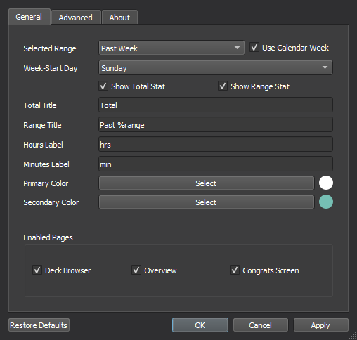

# 
Study Time Stats 

Add some customizable total study time and ranged study time statistics to Anki's main window!
  

## Installation  
Install from [Anki-Web](https://ankiweb.net/shared/info/1247171202)  
Or inside Anki (Tools -> Add-ons -> Get Add-ons...)
> 1247171202

## Options Menu  
### General
These settings can be used to change the visibility, look, and text of the rendered stats, as well as how the add-on should filter the total time.  

### Advanced
These settings can change other options outside of the UI.

  

The output text can also be changed here to show custom information using any of the available text macros:

## Text Macros
The add-on can also filter text in the custom labels input to show information based on what's set in the config (e.g. "Past %range" -> "Past Week"). These can be used multiple times and will update whenever Anki's main window reloads.

### Available Macros:
##### General
+ `%range` - the currently selected range format (Week, 2 Weeks, Month, Year)
+ `%from_date` - range filter's start date using the system's locale (2022-06-30)
+ `%from_day` - range filter's starting day using a compact format (Sun)
+ `%from_full_day` - range filter's full start day (Sunday)
+ `%from_month` - range filter's month name using a compact format (Sep)
+ `%from_full_month` - range filter's full month name (September)
+ `%days` - total days the range filter checks against (17)
##### Advanced
These macros will each index the received review logs and output its individual value-unit combination (e.g. "%total_hrs" -> "3.14 hrs").
+ `%total_hrs` - total study time
+ `%range_hrs` - ranged study time
+ `%prev_cal_hrs` - total study time of the last calendar range

Total time for a specific range (current week, current month, etc):
+ `%week_hrs`, `%two_week_hrs`, `%month_hrs`, `%year_hrs`

Total time for a specific, previous range (previous week, previous month, etc):
+ `%prev_day_hrs`, `%prev_week_hrs`, `%prev_two_week_hrs`, `%prev_month_hrs`, `%prev_year_hrs` 

Total time from a custom, specific date:
+ `%from_custom_date:<YYYY-MM-DD>`
    + Accepts a custom date input based on the date format presented above. Returns total hours since that specific point in time. (e.g. "%from_custom_date:2022-03-14" -> "22.5 hrs" (from 2022, March 14th))

##### Misc
+ `%%` - returns a single % symbol and doesn't apply the text macro (%, %range, etc)

#### Bugs/Issues:
Please post any issues or feedback you might have on [GitHub](https://github.com/iamjustkoi/StudyTimeStats/issues).
    

Wish you the best! -koi

MIT License ©2022 JustKoi (iamjustkoi)
