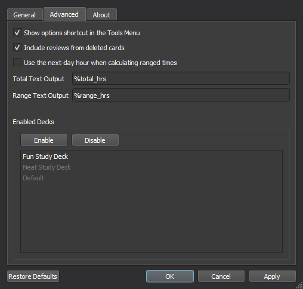

# 
Study Time Stats 

Add some customizable total study time and ranged study time statistics to Anki's main window!
  

## Installation  
Install from [Anki-Web](https://ankiweb.net/shared/info/1247171202)  
Or inside Anki (Tools -> Add-ons -> Get Add-ons...)
> 1247171202

## Options Menu  
### General
These settings can be used to change the visibility, look, and text of the rendered stats, as well as how the add-on should filter the total time.  

### Advanced

These settings can change other options outside of the UI.

  

The output text can also be changed here to show custom information using any of the available text macros:

### Text Macros

The add-on can also filter text in the custom labels input to show information based on what's set in the config (e.g. "
Past %range" to "Past Week"). These can be used multiple times and will update whenever Anki's main window reloads. You
can find more details via the "Macro" dialog that pops up after clicking the + icon inside any of the text inputs.

##### Misc

`%%` - returns a single % symbol and doesn't apply a text macro (e.g. %% -> %, %%range -> %range)
  
Thanks for downloading and hope you enjoy!
-koi
  
MIT License
©2022-2023 JustKoi (iamjustkoi)

#### Bugs/Issues:
Please post any issues or feedback you might have on [GitHub](https://github.com/iamjustkoi/StudyTimeStats/issues).
    

Wish you the best! -koi

MIT License ©2022 JustKoi (iamjustkoi)
